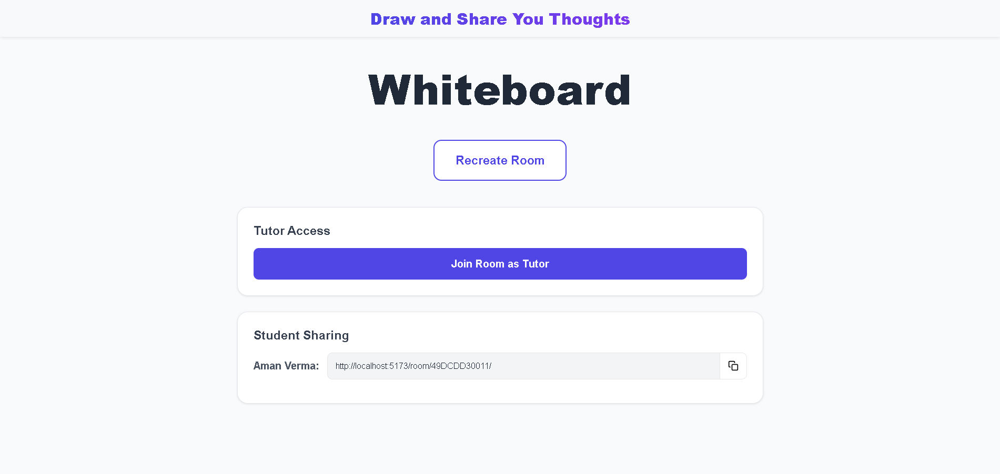
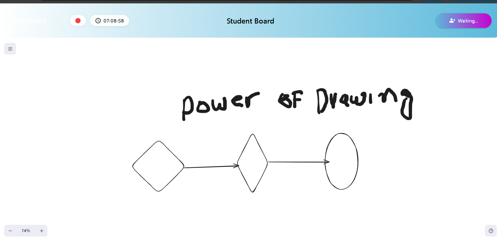

# 🎨 Interactive Whiteboard Service

An integrated, real-time collaborative whiteboard solution designed for seamless tutor-student interactions. This project provides a premium drawing experience with live synchronization, session management, and role-based access control.

---

## 🚀 Overview

This application is more than just a drawing tool; it's a complete **Integrated Whiteboard Service**. Whether you're conducting a one-on-one tutoring session or a group workshop, the platform ensures that every stroke is captured and shared instantly.

> [!NOTE]
> **Testing vs. Production**: For demonstration purposes, this repository includes manual session data. In a production environment, the service is designed to dynamically accept session, tutor, and student data from your existing administrative systems.

---

## ✨ Key Features

- **Real-time Collaboration**: Powered by Socket.io and Redis for instant, lag-free synchronization.
- **Role-Based Experience**: 
  - **Tutors**: Full control over the whiteboard, session monitoring, and permission management.
  - **Students**: Interactive participation with synchronized updates and request-to-draw features.
- **Smart Session Management**:
  - **Dynamic Timer**: Intelligent countdown that displays "Starts at", "Time Remaining", or "Session Ended".
  - **Auto-Expiry**: Rooms automatically expire after sessions end to ensure security and resource efficiency.
- **Premium UI/UX**: A clean, modern interface featuring custom date and time pickers for effortless session scheduling.
- **Persistent States**: Integrated with a robust backend to ensure whiteboard data is saved and restorable.

---

## 📸 Screenshots & Visuals

### 🏠 Home Dashboard

*The central hub for creating and managing whiteboard sessions. Featuring intuitive native date pickers and custom time selectors for precise scheduling.*

### 👨‍🏫 Tutor Workspace

*The educator's command center. Tutors have access to full drawing tools, student presence monitoring, and the ability to manage session duration in real-time.*

### 🎓 Student Experience

*A streamlined interface for students, receiving live updates from the tutor and participating interactively within the defined session parameters.*

---

## 🛠️ Setup & Installation (Frontend)

Follow these steps to get the frontend development environment running locally:

### Prerequisites
- **Node.js**: v20.x or higher
- **npm**: v10.x or higher

### Installation

1. **Clone the repository**
   ```bash
   git clone [YOUR_FRONTEND_REPO_LINK]
   cd whiteboard-frontend
   ```

2. **Install dependencies**
   ```bash
   npm install
   ```

3. **Configure Environment Variables**
   Create a `.env` file in the root directory and add:
   ```env
   VITE_SOCKET_URL=http://localhost:8085
   ```

4. **Launch the development server**
   ```bash
   npm run dev
   ```

---

## 🔗 Project Links

- **Live Deployment**: [Click here to explore the app](https://whiteboard-backend-yraqx.ondigitalocean.app)
- **Backend Repository**: [Whiteboard Backend Repo](https://github.com/Dharmendra2567/whiteboard_backend)

---

## 🏗️ Tech Stack

- **Framework**: React 19 + Vite
- **Drawing Engine**: @excalidraw/excalidraw
- **State Management**: Redux Toolkit
- **Real-time**: Socket.io Client
- **Styling**: Vanilla CSS (Modern Design System)

---

Developed with ❤️ as an integrated solution for modern digital education.
